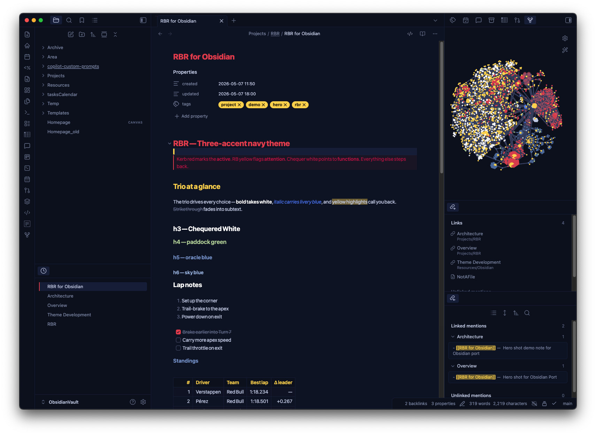

<h1 align="center">
  🏁&nbsp;&nbsp;rbr.obsidian
</h1>

<p align="center">
  <i>A Red Bull Racing colorscheme for Obsidian — the Obsidian port of <a href="https://github.com/Amdhj22/rbr">rbr-theme</a>.</i>
</p>

<p align="center">
  <a href="https://github.com/Amdhj22/rbr.obsidian/stargazers"></a>
  <a href="./LICENSE"></a>
  <a href="https://github.com/Amdhj22/rbr"></a>
</p>

&nbsp;

<p align="center">
  
</p>

&nbsp;

## About

`rbr.obsidian` paints Obsidian with the [RBR color scheme](https://github.com/Amdhj22/rbr) — a **three-accent** palette: **kerb red** for what's active, **RB yellow** for what needs attention, **chequer white** for functions / methods. A deep navy base keeps the trio readable. See the upstream [`STYLE-GUIDE.md`](https://github.com/Amdhj22/rbr/blob/main/STYLE-GUIDE.md) for the full design rules.

> [!NOTE]
> This scheme is a fan tribute. Not affiliated with or endorsed by Red Bull Racing, Oracle Red Bull Racing, or Red Bull GmbH.

&nbsp;

## Install

### Manual install (current)

1. Download `theme.css` and `manifest.json` from this repo.
2. Drop them into your vault at:
   ```
   <vault>/.obsidian/themes/RBR/
     ├── manifest.json
     └── theme.css
   ```
3. In Obsidian: **Settings → Appearance → Themes** → pick **RBR**.

> Tip: from the vault root, `mkdir -p .obsidian/themes/RBR` and copy the two files in.

### From source

```bash
git clone https://github.com/Amdhj22/rbr.obsidian.git
mkdir -p <your-vault>/.obsidian/themes/RBR
cp rbr.obsidian/{manifest.json,theme.css} <your-vault>/.obsidian/themes/RBR/
```

Reload Obsidian (`Cmd+R` / `Ctrl+R`) and pick **RBR** in **Settings → Appearance → Themes**.

### From the Obsidian Community Themes

Coming soon. Once published, install via **Settings → Appearance → Themes → Manage** → search **RBR**.

&nbsp;

## What it paints

`rbr.obsidian` covers the surfaces Obsidian exposes via CSS variables and a few hand-styled selectors:

| Layer | What it covers |
|---|---|
| **Workspace chrome** | Sidebar, file explorer, tabs (active tab → kerb-red top bar), title bar, status bar, modals, popovers, scrollbars |
| **Editor body** | Cursor (RB yellow), active line, selection (`surface2`), matching brackets, indentation guides, inline title |
| **Markdown rendering** | Headings (h1 = kerb red, h2 = RB yellow, h3 = chequer white), links, blockquotes (red side bar), tables, hr, bold/italic |
| **Code blocks & live preview** | CodeMirror token mapping — keywords = red, strings = green, functions = white, types = yellow, numbers = grey, comments = subtext |
| **Tags** | RB-yellow pill ("look here") |
| **Callouts** | `info`/`note` → oracle blue, `warning`/`todo` → RB yellow, `tip`/`success` → paddock green, `error`/`bug`/`fail` → kerb bright, `important` → kerb red |
| **Search & highlight** | Search matches and `==highlights==` tinted RB yellow |
| **Graph view** | Unresolved nodes → kerb bright, focused → kerb red, tag nodes → RB yellow, attachments → paddock green |
| **Properties / metadata** | Property keys in RB yellow, values in default text |

Highlights of the painting choices:

- **Active tab top border** = Kerb Red — only one tab is "the one"
- **Cursor** = RB Yellow — the always-attention pixel
- **Active file in the file explorer** gets a kerb-red accent bar on the left
- **Inline title** of the current note = Kerb Red
- **Vault name** in the title bar = RB Yellow
- **Blockquote** = kerb-red side border with a subtle red wash
- **`==highlight==`** = RB-yellow background (matches the search-match style)

&nbsp;

## Companion ports

For a consistent look across the rest of your stack:

| Tool | Repo |
|---|---|
| Neovim | [Amdhj22/rbr.nvim](https://github.com/Amdhj22/rbr.nvim) |
| VS Code | [Amdhj22/rbr.vscode](https://github.com/Amdhj22/rbr.vscode) |
| tmux | [Amdhj22/rbr.tmux](https://github.com/Amdhj22/rbr.tmux) |
| Ghostty / iTerm2 / Powerlevel10k / eza | [Amdhj22/rbr](https://github.com/Amdhj22/rbr) |

&nbsp;

## Development

```bash
git clone https://github.com/Amdhj22/rbr.obsidian.git
cd rbr.obsidian

# Symlink into a test vault for live editing
ln -s "$PWD" "<your-test-vault>/.obsidian/themes/RBR"
```

Then in Obsidian: **Settings → Appearance → Themes → RBR**. Edits to `theme.css` show up after `Cmd+R` (Reload).

For deeper inspection, open Obsidian's developer tools with `Cmd+Option+I` (macOS) or `Ctrl+Shift+I` (Windows / Linux). The Styles pane lets you find the CSS variable behind any element before adding a rule here.

&nbsp;

## Submitting to the Community Themes gallery

Once the repo is public, follow Obsidian's [submission flow](https://docs.obsidian.md/Themes/App+themes/Theme+guidelines):

1. Tag a release matching `manifest.json`'s `version` (e.g. `0.1.0`).
2. Open a PR against [`obsidianmd/obsidian-releases`](https://github.com/obsidianmd/obsidian-releases) adding RBR to `community-css-themes.json`.
3. After review, RBR appears under **Settings → Appearance → Themes → Manage**.

&nbsp;

## License

[MIT](./LICENSE) © Amdhj22
